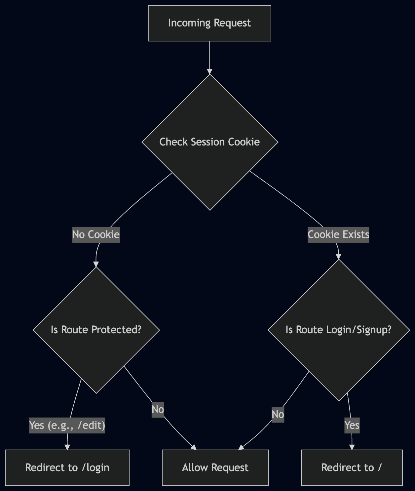
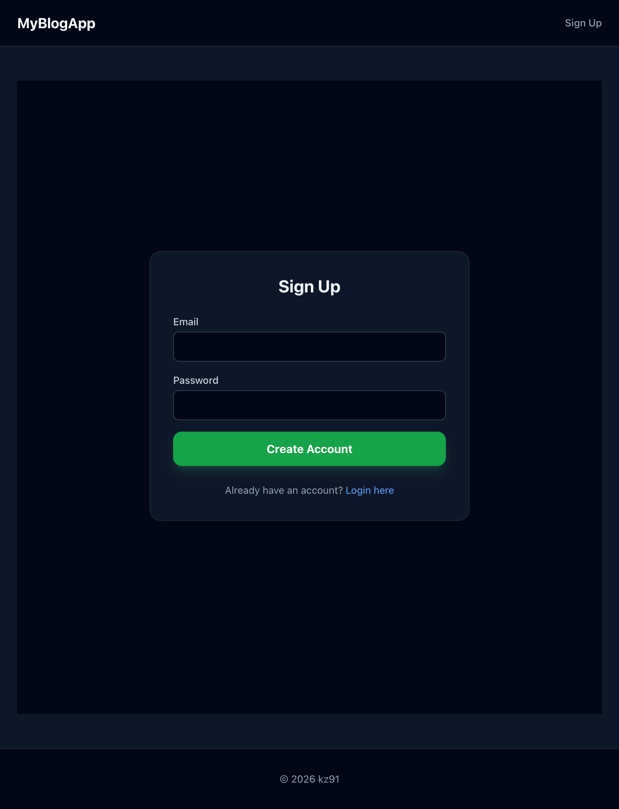
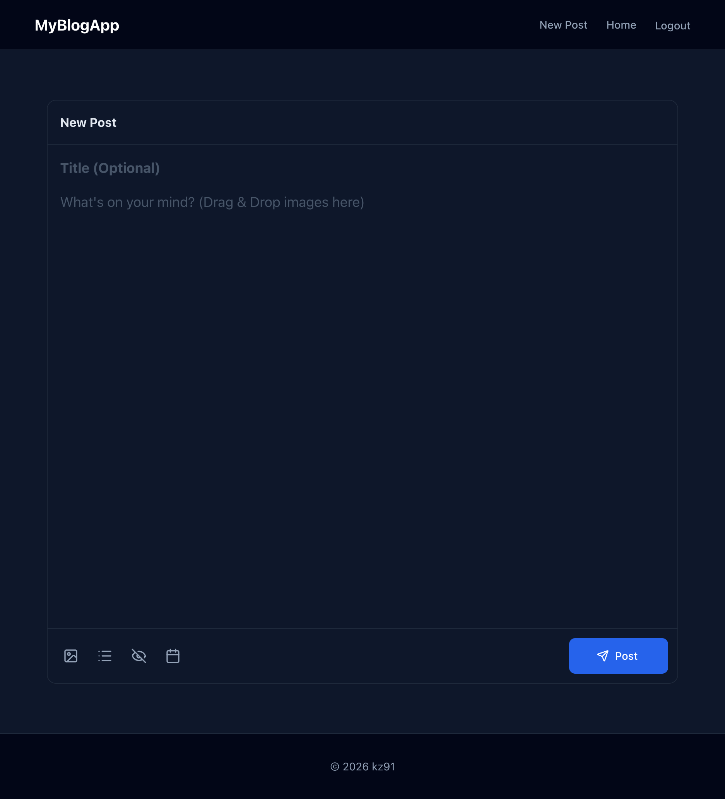
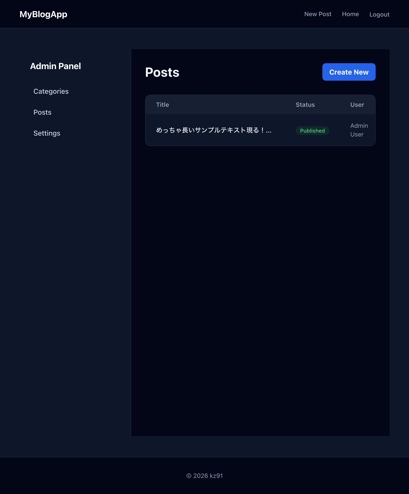
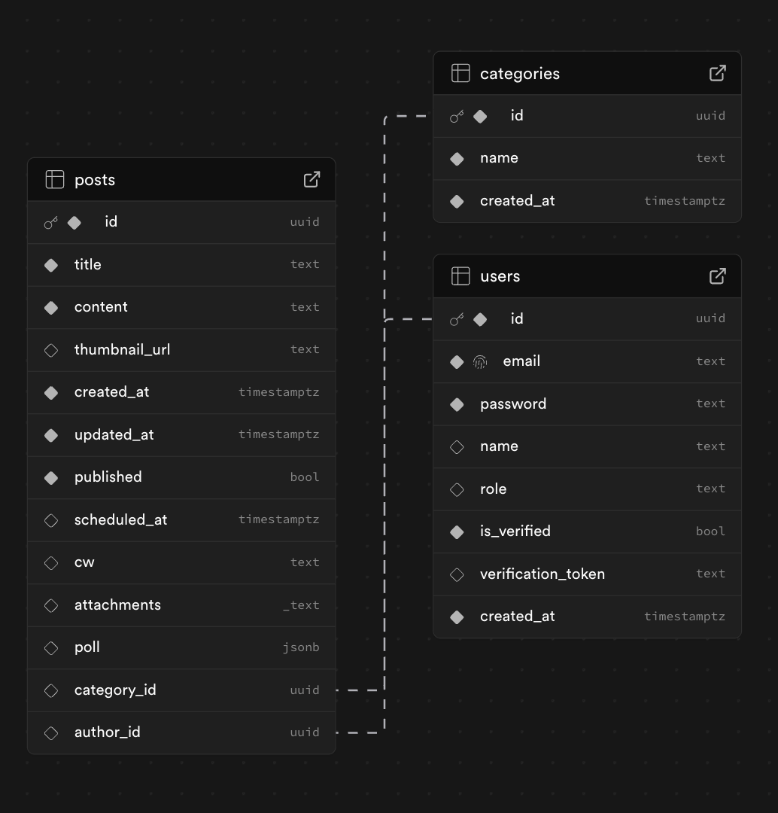

## Prog3-Blog

Vercel Link:
https://prog3-blog.vercel.app/

## 1. Project Overview

本プロジェクトは、リッチなコンテンツ配信とユーザーインタラクションを目的としたWebベースのブログアプリケーションです。一般ユーザーは記事や投票（Poll）の閲覧ができ、権限を持つユーザー（管理者および作成者）は直感的なインターフェースからコンテンツを作成・編集できます。

## 2. Technology Stack

* **Frontend**: Next.js 15 (App Router), React 19, TypeScript
* **Styling**: Tailwind CSS, Lucide React (Icons)
* **Backend Logic**: Next.js Server Actions
* **Database**: Supabase (PostgreSQL)
* **Authentication**: Resend (Mail Authentication)
* **Image Storage**: Local filesystem (`public/uploads`) 

## 3. Key Features

### Authentication & Security
独自の「Simple Auth」に **Resend** を組み合わせたメール認証システムを導入しています。
* サインアップ時の確実な本人確認（メール検証）。
* セッション管理はJSON形式のユーザーデータを含む `user_session` クッキーで行います。
* `middleware.ts` により、保護されたルート（`/posts/create`、`/edit`、`/admin` など）への未認証アクセスをブロックします。

### Post Management (新規投稿・編集)
作成者および管理者は、専用のエディタから記事を作成・管理できます。
* **リッチテキスト**: `react-markdown` によるMarkdown記法をサポート。
* **コンテンツ制御**: Content Warning (CW) ラッパーや、公開スケジュールの設定（`scheduled_at`）に対応。
* **ファイルアップロード**: 複数ファイルのアップロードが可能（保存先は `public/uploads`）。

### Admin Features
管理者（Admin）専用のパネルを備えており、アプリケーション全体の管理が可能です。ミドルウェアによる厳密な権限チェックが行われます。（※初期テスト用に、`seed.sql` にAdminユーザーとMockユーザーのデータが含まれています）

### Interactive Polls
記事内に複数の選択肢を持つ投票（Poll）を設置できます。投票データはJSONB構造で管理され、Next.jsのRevalidation機能を通じてリアルタイムに結果が更新されます。

## 4. Architecture & Directory Structure

* `app/`: メインのアプリケーションコード（App Router）
* `actions.ts`: データの変更処理（記事の作成/編集、ファイルアップロードなど）を担うServer Actions
* `lib/db.ts`: データベースアクセス層（Supabaseクライアント）
* `middleware.ts`: 認証による保護機能およびリダイレクトのロジック
* `supabase/`: データベース関連の設定ファイル (`schema.sql`, `seed.sql`)

## 5. Data Model (Supabase)

現在の開発フェーズでは、データへのアクセスをシンプルにするため、すべてのテーブルにおいてRow Level Security (RLS) は **無効化（Disabled）** されています。

* **`users`**: 認証およびユーザー情報の管理（`id`, `email`, `password`, `name`, `role`）。※パスワードは平文で保存される設計（開発用）。
* **`categories`**: 記事のカテゴライズ（`id`, `name`）。
* **`posts`**: メインコンテンツ。Markdownテキスト、添付ファイル（`attachments`）、投票データ（`poll` - JSONB）、画像パスなどを保持。`author_id` と `category_id` を介して他テーブルとリレーションを持ちます。